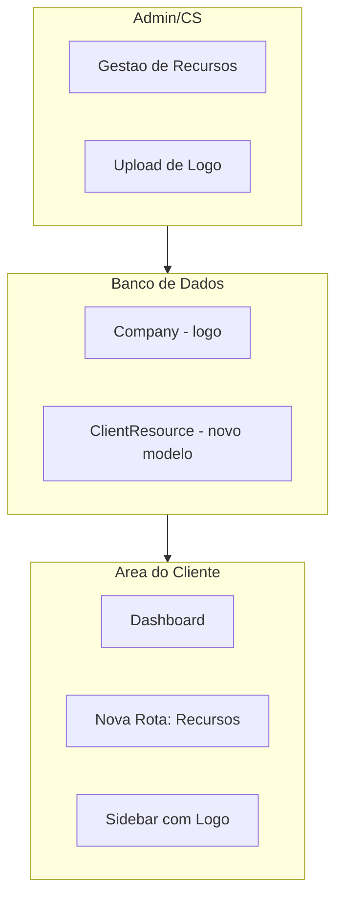
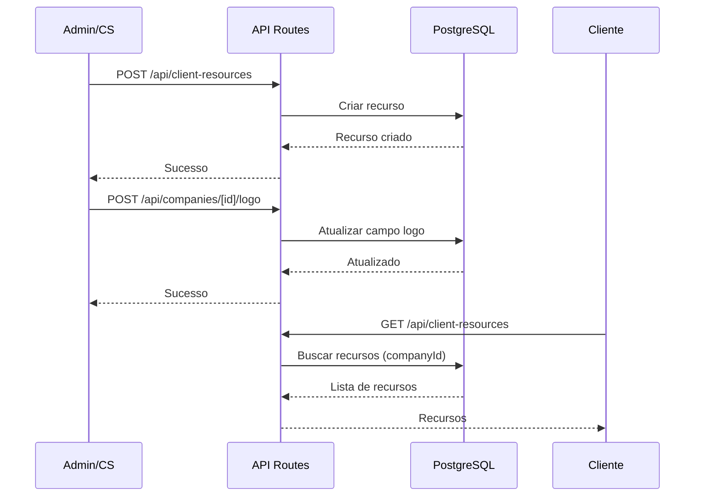

# Plano de Melhoria - Área de Cliente

## Contexto Atual

A área de cliente já existe em `/cliente` com:

- Dashboard, Entregas, Pesquisas, Documentação, Suporte e Configurações
- Dados mockados (`mockClientData`) em vez de dados reais da API
- Logo genérica (ícone Zap) na sidebar
- Página de documentação estática com recursos hardcoded

O modelo `Company` já possui campo `logo: String?` mas não está sendo utilizado.

## Arquitetura da Solução



## Mudancas Necessarias

### 1. Schema do Banco de Dados

Criar novo modelo `ClientResource` em [prisma/schema.prisma](prisma/schema.prisma):

```prisma
model ClientResource {
  id          String               @id @default(cuid())
  title       String
  description String?
  url         String?
  type        ClientResourceType
  category    String?
  isActive    Boolean              @default(true)
  order       Int                  @default(0)
  createdAt   DateTime             @default(now())
  updatedAt   DateTime             @updatedAt

  company     Company              @relation(fields: [companyId], references: [id], onDelete: Cascade)
  companyId   String

  createdBy   User?                @relation(fields: [createdById], references: [id])
  createdById String?

  @@map("client_resources")
}

enum ClientResourceType {
  AUTOMATION
  IPC
  LINK
  DOCUMENT
  VIDEO
}
```

### 2. Nova Rota do Cliente - `/cliente/recursos`

Criar [src/app/cliente/recursos/page.tsx](src/app/cliente/recursos/page.tsx):

- Exibir recursos agrupados por categoria/tipo
- Cards para automações com link para GPT
- Cards para IPCs
- Links úteis organizados
- Documentos e vídeos

Atualizar [src/components/layout/cliente-sidebar.tsx](src/components/layout/cliente-sidebar.tsx):

- Adicionar item "Recursos" no menu de navegação

### 3. API para Recursos

Criar [src/app/api/client-resources/route.ts](src/app/api/client-resources/route.ts):

- `GET` - Listar recursos da empresa (filtrado por companyId do usuário)
- `POST` - Criar recurso (apenas CS_OWNER e ADMIN)

Criar [src/app/api/client-resources/[id]/route.ts](src/app/api/client-resources/[id]/route.ts):

- `PATCH` - Atualizar recurso
- `DELETE` - Remover recurso

### 4. Gestao de Recursos (Admin/CS)

Adicionar seção na página da empresa [src/app/admin/empresas/[id]/page.tsx](src/app/admin/empresas/[id]/page.tsx) e [src/app/cs/empresas/[id]/page.tsx](src/app/cs/empresas/[id]/page.tsx):

- Nova aba "Recursos do Cliente"
- Formulário para adicionar/editar recursos
- Lista de recursos existentes com ações (editar, excluir, reordenar)

### 5. Upload de Logo da Empresa

Adicionar componente de upload em:

- [src/app/admin/empresas/[id]/page.tsx](src/app/admin/empresas/[id]/page.tsx)
- [src/app/cs/empresas/[id]/page.tsx](src/app/cs/empresas/[id]/page.tsx)

Criar API [src/app/api/companies/[id]/logo/route.ts](src/app/api/companies/[id]/logo/route.ts):

- `POST` - Upload de logo (salvar em Vercel Blob ou similar)
- `DELETE` - Remover logo

### 6. Exibir Logo no Painel do Cliente

Atualizar [src/components/layout/cliente-sidebar.tsx](src/components/layout/cliente-sidebar.tsx):

- Buscar logo da empresa do usuário logado
- Substituir ícone Zap pela logo quando disponível
- Fallback para ícone quando não houver logo

### 7. Integracao com Dados Reais

Atualizar [src/app/cliente/dashboard/page.tsx](src/app/cliente/dashboard/page.tsx):

- Criar API `/api/cliente/dashboard` para buscar dados reais
- Substituir `mockClientData` por dados da API
- Incluir entregas, workshops, hotseats, contatos e documentos reais

## Arquivos Principais a Criar/Modificar

**Novos arquivos:**

- `prisma/schema.prisma` (adicionar modelo)
- `src/app/cliente/recursos/page.tsx`
- `src/app/api/client-resources/route.ts`
- `src/app/api/client-resources/[id]/route.ts`
- `src/app/api/companies/[id]/logo/route.ts`
- `src/app/api/cliente/dashboard/route.ts`
- `src/services/client-resource.service.ts`

**Arquivos a modificar:**

- `src/components/layout/cliente-sidebar.tsx`
- `src/app/admin/empresas/[id]/page.tsx`
- `src/app/cs/empresas/[id]/page.tsx`
- `src/app/cliente/dashboard/page.tsx`

## Dependencias

Para upload de arquivos, considerar usar `@vercel/blob` que já é compatível com deploy na Vercel:

```bash
npm install @vercel/blob
```

## Fluxo de Dados

