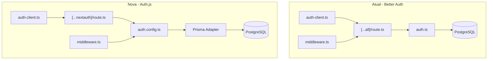

# Migração do Better Auth para Auth.js

## Contexto

O Better Auth está apresentando problemas de compatibilidade com o Edge Runtime da Vercel no middleware. O Auth.js (NextAuth v5) é mais maduro e tem integração nativa com Next.js/Vercel.

## Arquitetura Atual vs Nova

## Funcionalidades a Migrar

- Login com email/senha (Credentials Provider)
- Verificação de email (custom)
- Reset de senha (custom)
- Sessões JWT (mais simples para Edge Runtime)
- Roles: ADMIN, CS_OWNER, CLIENT
- Campos customizados: role, csOwnerId, companyId
- Proteção de rotas no middleware

## Mudanças no Schema Prisma

O Auth.js usa nomes de tabelas/campos ligeiramente diferentes. Precisamos adaptar:

- `User` - manter, adicionar campos do Auth.js
- `Session` - manter estrutura atual (compatível)
- `Account` - ajustar campos para padrão Auth.js
- `VerificationToken` - renomear de `Verification`

## Arquivos a Modificar

**Novos arquivos:**

- `src/auth.ts` - Configuração principal do Auth.js
- `src/auth.config.ts` - Configuração para Edge Runtime
- `src/app/api/auth/[...nextauth]/route.ts` - Nova rota

**Arquivos a modificar:**

- `src/lib/auth-client.ts` - Usar hooks do Auth.js
- `src/lib/auth-server.ts` - Usar `auth()` do Auth.js
- `src/middleware.ts` - Usar `auth` do config
- `src/app/page.tsx` - Usar `signIn` do Auth.js
- `src/contexts/user-context.tsx` - Adaptar para Auth.js
- `prisma/schema.prisma` - Ajustar para Auth.js Adapter
- Páginas de esqueci-senha, redefinir-senha, verificar-email

**Arquivos a remover:**

- `src/lib/auth.ts` (Better Auth config)
- `src/app/api/auth/[...all]/route.ts`

## Estratégia de Sessão

Auth.js suporta duas estratégias:

- **JWT** (recomendado para Edge) - Token no cookie, sem consulta ao banco
- **Database** - Sessão armazenada no banco

Usaremos **JWT** para compatibilidade com Edge Runtime da Vercel.

## Dependências

**Remover:**

- `better-auth`
- `@better-fetch/fetch`

**Adicionar:**

- `next-auth@beta` (v5)
- `@auth/prisma-adapter`
- `bcryptjs` (para hash de senha)
- `@types/bcryptjs`