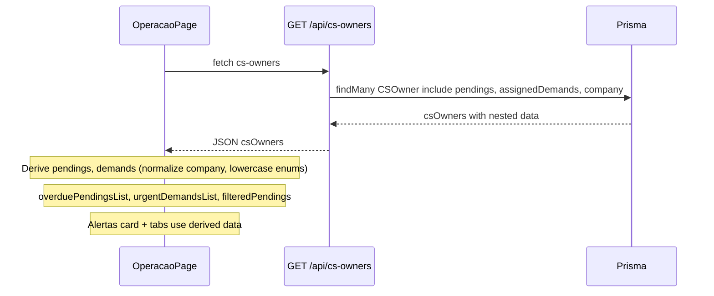

# Operação: Alertas e listas com dados da API

## Situação atual

- A página [src/app/admin/operacao/page.tsx](src/app/admin/operacao/page.tsx) já carrega **CS Owners** da API `GET /api/cs-owners`.
- **Alertas**, abas **Pendências** e **Demandas**, e contagens por CS usam **mock**: `mockPendings`, `mockDemands` e `mockTeamActivities` de [src/lib/data/cs-mock.ts](src/lib/data/cs-mock.ts).
- No backend, **pendings** e **demands** existem no Prisma ([prisma/schema.prisma](prisma/schema.prisma): `Pending`, `Demand`) e o serviço [cs-owner.service.ts](src/services/cs-owner.service.ts) em `findAllWithMetrics()` já busca `pendings` e `assignedDemands` por CS Owner, mas **sem** a relação `company`, então o front não consegue exibir “empresa” nos itens.

## Objetivo

- Fonte única: **GET /api/cs-owners** (já usada pela página).
- A partir da resposta, derivar no frontend:
  - **Alertas:** pendências atrasadas (status OVERDUE) e demandas urgentes (priority URGENT e status não COMPLETED).
  - **Abas Pendências / Demandas:** listas completas (com filtro por CS quando houver).
- Manter **atividades** em mock por enquanto (não há endpoint de atividades para admin); só pendências e demandas passam a vir da API.

## Backend

### 1. Incluir `company` em pendings e assignedDemands

**Arquivo:** [src/services/cs-owner.service.ts](src/services/cs-owner.service.ts), método `findAllWithMetrics()`.

- No `include` do `prisma.cSOwner.findMany`:
  - Em **pendings**: adicionar `include: { company: { select: { id: true, name: true } } }`.
  - Em **assignedDemands**: adicionar `include: { company: { select: { id: true, name: true } } }`.

Assim, cada item de `pendings` e `assignedDemands` no JSON passa a trazer `company: { id, name }` (ou `null`), permitindo exibir o nome da empresa no card de Alertas e nas linhas das abas.

## Frontend

### 2. Derivar pendências e demandas a partir de `csOwners`

**Arquivo:** [src/app/admin/operacao/page.tsx](src/app/admin/operacao/page.tsx).

- **Remover** import e uso de `mockPendings` e `mockDemands` (manter `mockTeamActivities` por enquanto).
- **Após** carregar `csOwners` com `fetch("/api/cs-owners")`:
  - **Pendências:**  
  `pendings = csOwners.flatMap(cs => (cs.pendings || []).map(p => ({ ...p, company: p.company?.name ?? '', status: p.status.toLowerCase(), type: p.type.toLowerCase(), priority: (p.priority || 'MEDIUM').toLowerCase(), dueDate: p.dueDate })))`.
  - **Demandas:**  
  `demands = csOwners.flatMap(cs => (cs.assignedDemands || []).map(d => ({ ...d, company: d.company?.name ?? '', status: d.status.toLowerCase(), priority: (p.priority || 'MEDIUM').toLowerCase(), type: (d.type || 'REQUEST').toLowerCase() })))`.
- Guardar em estado (ex.: `pendings`, `demands`) ou derivar em `useMemo` a partir de `csOwners`, para não depender mais de mock.

### 3. Usar as listas derivadas em todo o fluxo

- **Alertas:**  
  - `overduePendingsList = pendings.filter(p => p.status === 'overdue')`.  
  - `urgentDemandsList = demands.filter(d => d.priority === 'urgent' && d.status !== 'completed')`.  
  - Manter a UI atual do card (título, empresa, data quando fizer sentido).
- **KPIs / resumos:**  
  - Total de demandas não concluídas: usar `demands.filter(d => d.status !== 'completed').length` em vez de `mockDemands.filter(...)`.
- **Abas Pendências / Demandas:**  
  - `filteredPendings`: filtrar `pendings` por `selectedCS` (csOwnerId) quando houver filtro; senão, usar `pendings`.  
  - Lista de demandas: usar `demands` (e, se no futuro houver filtro por CS, filtrar por `assignedToId`).  
  - Substituir qualquer uso de `mockPendings` / `mockDemands` por essas listas derivadas.
- **Cards por CS (overdue):**  
  - Contagem de atrasadas por CS: `pendings.filter(p => p.csOwnerId === cs.id && p.status === 'overdue').length`, usando o mesmo estado `pendings`.

### 4. Tipos e componentes

- **PendingRow / DemandRow:** hoje usam tipos do mock (`Pending`, `Demand` com `company: string`, enums em minúsculo). O shape derivado acima já fica compatível (company string, status/priority/type em minúsculo). Ajustar apenas se o tipo global `Pending`/`Demand` for importado do mock; nesse caso, usar um tipo local ou um tipo “view” que reflita o shape normalizado (id, title, company, status, priority, type, dueDate, csOwnerId, assignedToId, etc.).
- Garantir que `dueDate` seja string (ou que `formatDate` aceite o valor vindo da API); se a API enviar ISO string, está ok.

### 5. Atividades

- Manter `mockTeamActivities` e `filteredActivities` como estão; não há endpoint de atividades para admin neste escopo. Se no futuro existir algo como `GET /api/operacao/activities`, a mesma página pode passar a usar essa API e remover o mock de atividades.

## Resumo de arquivos

| Onde                                                                 | O que fazer                                                                                                                                       |
| -------------------------------------------------------------------- | ------------------------------------------------------------------------------------------------------------------------------------------------- |
| [src/services/cs-owner.service.ts](src/services/cs-owner.service.ts) | Em `findAllWithMetrics()`, incluir `company` em `pendings` e `assignedDemands`.                                                                   |
| [src/app/admin/operacao/page.tsx](src/app/admin/operacao/page.tsx)   | Remover mock de pendências/demandas; derivar `pendings` e `demands` de `csOwners`; usar nas alertas, abas e contagens; manter mock de atividades. |

## Fluxo de dados (resumido)

Com isso, os alertas e as listas de pendências e demandas passam a refletir apenas dados do sistema (API), sem mock para esses domínios.