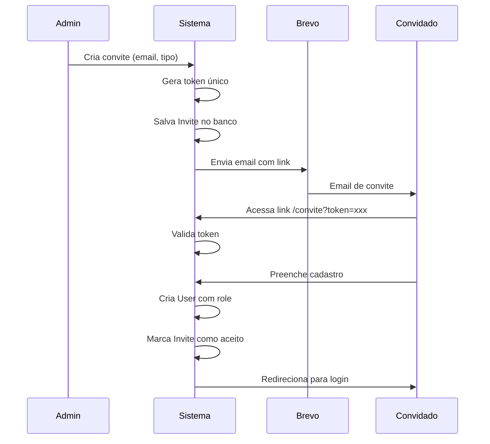

# Página de Convites e Gestão de Acesso (Admin)

## Contexto Atual

- **Autenticação**: Better Auth com roles (ADMIN, CS_OWNER, CLIENT)
- **Email**: Não implementado (apenas console.log em dev)
- **Schema**: Não existe modelo de Invite
- **Área Admin**: Já existe em `/admin/` com sidebar configurada

---

## 1. Integração com Brevo

Instalar SDK oficial da Brevo e criar serviço de email.

**Arquivo**: `src/services/email.service.ts`

```typescript
import * as brevo from "@getbrevo/brevo";

export const emailService = {
  async sendInvite(to: string, inviteUrl: string, type: "COMPANY" | "MEMBER") { ... },
  async sendPasswordReset(to: string, resetUrl: string) { ... },
  async sendVerification(to: string, verifyUrl: string) { ... },
};
```

**Variáveis de ambiente**: `BREVO_API_KEY`

---

## 2. Schema do Prisma - Modelo Invite

Adicionar ao [prisma/schema.prisma](prisma/schema.prisma):

```prisma
enum InviteType {
  COMPANY_ADMIN    // Convite para admin de uma empresa
  MEMBER_ADMIN     // Convite para membro Admin
  MEMBER_CS        // Convite para CS Owner
}

enum InviteStatus {
  PENDING
  ACCEPTED
  EXPIRED
  CANCELLED
}

model Invite {
  id          String       @id @default(cuid())
  email       String
  type        InviteType
  status      InviteStatus @default(PENDING)
  token       String       @unique
  expiresAt   DateTime
  createdAt   DateTime     @default(now())
  
  company     Company?     @relation(fields: [companyId], references: [id])
  companyId   String?
  
  invitedBy   User         @relation(fields: [invitedById], references: [id])
  invitedById String
  
  @@map("invites")
}
```

---

## 3. Serviço de Convites

**Arquivo**: `src/services/invite.service.ts`

Funções principais:

- `createInvite(data)` - Cria convite e envia email
- `findAll()` - Lista todos os convites
- `findByToken(token)` - Busca convite pelo token
- `acceptInvite(token)` - Aceita convite e cria usuário
- `cancelInvite(id)` - Cancela convite
- `resendInvite(id)` - Reenvia email do convite

---

## 4. APIs Routes

**Endpoints**:

- `POST /api/invites` - Criar convite
- `GET /api/invites` - Listar convites (com filtros)
- `POST /api/invites/[id]/resend` - Reenviar convite
- `DELETE /api/invites/[id]` - Cancelar convite
- `POST /api/invites/accept` - Aceitar convite (com token)

**Arquivo**: `src/app/api/invites/route.ts`

---

## 5. Página de Administração

**Arquivo**: `src/app/admin/acessos/page.tsx`

### Layout com Tabs:

- **Convites**: Criar e gerenciar convites pendentes
- **Usuários**: Listar usuários e gerenciar atribuições
- **Empresas sem acesso**: Lista de empresas sem usuário vinculado

### Componentes da Página:

**InviteForm** - Formulário de convite:

- Campo email
- Select tipo (Empresa/Admin/CS)
- Select empresa (se tipo = Empresa)
- Botão enviar

**InviteList** - Lista de convites:

- Email, tipo, status, data
- Ações: reenviar, cancelar

**UserList** - Lista de usuários:

- Nome, email, role, empresa vinculada
- Ação: atribuir a empresa

**CompaniesWithoutAccess** - Empresas sem usuário:

- Nome da empresa
- Botão para enviar convite

---

## 6. Página de Aceite do Convite

**Arquivo**: `src/app/(auth)/convite/page.tsx`

Fluxo:

1. Usuário acessa link com token
2. Valida token (não expirado, pendente)
3. Formulário de cadastro (nome, senha)
4. Cria usuário com role correto e vincula à empresa (se aplicável)
5. Marca convite como aceito
6. Redireciona para login

---

## 7. Atualizar Sidebar Admin

Adicionar item "Acessos" no menu em [src/components/layout/sidebar.tsx](src/components/layout/sidebar.tsx):

```typescript
{ name: "Acessos", href: "/admin/acessos", icon: UserPlus, color: "from-cyan-500 to-blue-500" }
```

---

## 8. Integrar Better Auth com Brevo

Atualizar [src/lib/auth.ts](src/lib/auth.ts) para usar `emailService` nos callbacks de reset de senha e verificação de email.

---

## Diagrama de Fluxo



---

## Dependências

- `@getbrevo/brevo` - SDK oficial da Brevo