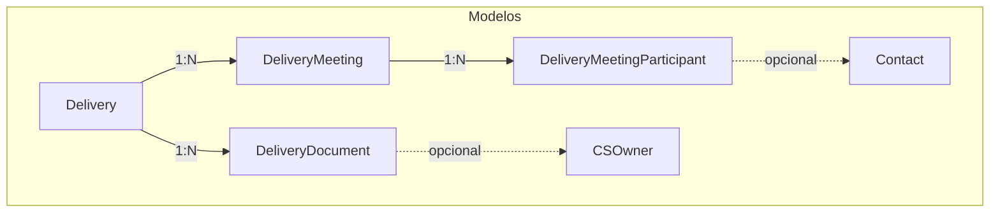

# Rota de Entregas para CS e Admin

## Contexto Atual

- Modelo `Delivery` existe em [prisma/schema.prisma](prisma/schema.prisma) com campos básicos (title, status, progress, dueDate, etc.)
- Modelo `Meeting` existe mas vinculado a `Company`, não a `Delivery`
- Não há modelo de documentos para entregas
- Entregas aparecem apenas como componentes em outras páginas, sem rota dedicada

## Novos Modelos Prisma

### 1. DeliveryMeeting (Reunião da Entrega)

```prisma
model DeliveryMeeting {
  id          String   @id @default(cuid())
  title       String
  description String?
  date        DateTime
  duration    Int?
  meetingLink String?
  fathomLink  String?
  notes       String?
  status      MeetingStatus @default(SCHEDULED)
  createdAt   DateTime @default(now())
  updatedAt   DateTime @updatedAt

  delivery      Delivery @relation(...)
  deliveryId    String
  participants  DeliveryMeetingParticipant[]

  @@map("delivery_meetings")
}
```

### 2. DeliveryMeetingParticipant (Participantes)

```prisma
model DeliveryMeetingParticipant {
  id        String   @id @default(cuid())
  name      String
  email     String?
  role      String?
  attended  Boolean  @default(false)
  createdAt DateTime @default(now())

  meeting   DeliveryMeeting @relation(...)
  meetingId String
  contact   Contact? @relation(...)
  contactId String?

  @@map("delivery_meeting_participants")
}
```

### 3. DeliveryDocument (Documentos)

```prisma
model DeliveryDocument {
  id          String   @id @default(cuid())
  title       String
  description String?
  url         String
  type        DocumentType @default(OTHER)
  createdAt   DateTime @default(now())
  updatedAt   DateTime @updatedAt

  delivery   Delivery @relation(...)
  deliveryId String
  uploadedBy CSOwner? @relation(...)
  uploadedById String?

  @@map("delivery_documents")
}

enum DocumentType {
  PRESENTATION
  SPREADSHEET
  PDF
  VIDEO
  LINK
  OTHER
}
```

## Estrutura de Rotas

### Painel CS (`/cs/entregas`)

```
src/app/cs/entregas/
├── page.tsx              # Lista de entregas do CS
└── [id]/
    └── page.tsx          # Detalhes da entrega
```

### Painel Admin (`/admin/entregas`)

```
src/app/admin/entregas/
├── page.tsx              # Lista de todas entregas
└── [id]/
    └── page.tsx          # Detalhes da entrega
```

## Página de Detalhes da Entrega

Layout com abas:

- **Visão Geral**: Status, progresso, prazo, responsável, blockers
- **Reuniões**: Lista de reuniões, botão adicionar, link Fathom, participantes
- **Documentos**: Upload/link de documentos, categorização
- **Timeline**: Histórico de alterações (usa `TimelineEvent` existente)

## APIs Necessárias

| Rota | Método | Função |

|------|--------|--------|

| `/api/deliveries` | GET | Listar entregas (com filtros) |

| `/api/deliveries/[id]` | GET | Detalhes da entrega |

| `/api/deliveries/[id]` | PATCH | Atualizar entrega |

| `/api/deliveries/[id]/meetings` | GET/POST | Reuniões da entrega |

| `/api/deliveries/[id]/meetings/[meetingId]` | PATCH/DELETE | Gerenciar reunião |

| `/api/deliveries/[id]/meetings/[meetingId]/participants` | POST/DELETE | Participantes |

| `/api/deliveries/[id]/documents` | GET/POST | Documentos da entrega |

| `/api/deliveries/[id]/documents/[docId]` | DELETE | Remover documento |

## Componentes a Criar

- `DeliveryCard` - Card de entrega na listagem
- `DeliveryDetails` - Componente de detalhes
- `DeliveryMeetingList` - Lista de reuniões
- `DeliveryMeetingForm` - Modal para adicionar/editar reunião
- `DeliveryDocumentList` - Lista de documentos
- `DeliveryDocumentUpload` - Modal para adicionar documento
- `ParticipantSelector` - Seletor de participantes (busca contatos)

## Navegação

Adicionar em [src/components/layout/sidebar.tsx](src/components/layout/sidebar.tsx):

```typescript
{ name: "Entregas", href: "/admin/entregas", icon: Package, color: "from-amber-500 to-orange-500" }
```

Adicionar em [src/components/layout/cs-sidebar.tsx](src/components/layout/cs-sidebar.tsx):

```typescript
{ name: "Entregas", href: "/cs/entregas", icon: Package, color: "from-amber-500 to-orange-500" }
```

## Fluxo de Dados



## Ordem de Implementação

1. Modelos Prisma + migração
2. APIs base (CRUD entregas, reuniões, documentos)
3. Páginas de listagem (CS e Admin)
4. Página de detalhes com abas
5. Componentes de reunião (formulário, lista, participantes)
6. Componentes de documentos
7. Integração com sidebar