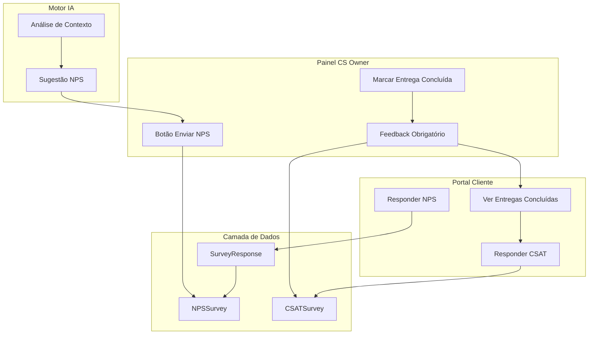
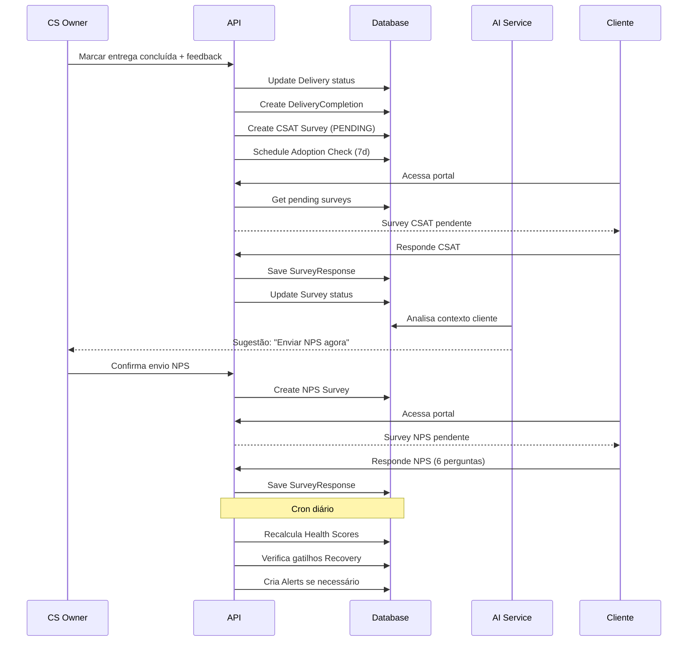

# Sistema de Pesquisa de Satisfação (NPS/CSAT)

## Arquitetura Geral



## 1. Modelos de Dados (Prisma)

Adicionar ao [`prisma/schema.prisma`](prisma/schema.prisma):

```prisma
enum SurveyType {
  NPS
  CSAT
  ADOPTION_CHECK
}

enum SurveyStatus {
  PENDING
  COMPLETED
  EXPIRED
}

model Survey {
  id          String       @id @default(cuid())
  type        SurveyType
  status      SurveyStatus @default(PENDING)
  companyId   String
  company     Company      @relation(fields: [companyId], references: [id])
  deliveryId  String?
  delivery    Delivery?    @relation(fields: [deliveryId], references: [id])
  workshopId  String?
  workshop    Workshop?    @relation(fields: [workshopId], references: [id])
  requestedBy String?
  csOwner     CSOwner?     @relation(fields: [requestedBy], references: [id])
  aiSuggested Boolean      @default(false)
  aiReason    String?
  expiresAt   DateTime?
  createdAt   DateTime     @default(now())
  response    SurveyResponse?
}

model SurveyResponse {
  id            String   @id @default(cuid())
  surveyId      String   @unique
  survey        Survey   @relation(fields: [surveyId], references: [id])
  respondentId  String
  respondent    User     @relation(fields: [respondentId], references: [id])
  
  // NPS Fields
  npsScore      Int?
  atendimentoScore    Int?
  prazosScore         Int?
  qualidadeScore      Int?
  treinamentoScore    Int?
  clarezaScore        Int?
  
  // CSAT Fields
  csatScore     Int?
  
  // Common
  comment       String?
  createdAt     DateTime @default(now())
}

model DeliveryCompletion {
  id          String   @id @default(cuid())
  deliveryId  String   @unique
  delivery    Delivery @relation(fields: [deliveryId], references: [id])
  completedBy String
  csOwner     CSOwner  @relation(fields: [completedBy], references: [id])
  feedback    String
  completedAt DateTime @default(now())
}
```

Atualizar models existentes para adicionar relações:

- `Company`: adicionar `surveys Survey[]`
- `Delivery`: adicionar `survey Survey?`, `completion DeliveryCompletion?`
- `Workshop`: adicionar `survey Survey?`
- `CSOwner`: adicionar `requestedSurveys Survey[]`, `completions DeliveryCompletion[]`
- `User`: adicionar `surveyResponses SurveyResponse[]`

## 2. Fluxo de Conclusão de Entrega (CS Owner)

### API Route

`src/app/api/deliveries/[id]/complete/route.ts`

```typescript
// POST: Marcar entrega como concluída
// Body: { feedback: string }
// - Valida que feedback não está vazio
// - Atualiza status da Delivery para COMPLETED
// - Cria registro DeliveryCompletion
// - Cria Survey CSAT automático para o cliente
// - Registra TimelineEvent
```

### Componente UI

`src/components/cs/delivery-completion-dialog.tsx`

- Dialog com campo de feedback obrigatório (textarea)
- Validação mínima de 50 caracteres
- Preview do que o cliente verá
- Botão de confirmação

## 3. Portal do Cliente - Pesquisas Pendentes

### API Route

`src/app/api/cliente/surveys/route.ts`

```typescript
// GET: Lista pesquisas pendentes do cliente
// - Filtra por companyId do usuário logado
// - Status PENDING e não expiradas
```

### Componente Modal CSAT

`src/components/cliente/csat-survey-modal.tsx`

- Exibe automaticamente ao acessar área do cliente
- Pergunta: "Como você avalia esta entrega?" (0-10)
- Campo de comentário opcional
- Não permite fechar sem responder

### Componente Modal NPS

`src/components/cliente/nps-survey-modal.tsx`

- 6 perguntas obrigatórias (0-10):
  - Recomendação (NPS clássico)
  - Atendimento
  - Prazos
  - Qualidade das Soluções
  - Treinamento (CNH da IA)
  - Clareza
- Campo de comentário opcional

## 4. Envio de NPS pelo CS Owner

### API Route

`src/app/api/surveys/nps/route.ts`

```typescript
// POST: Criar pesquisa NPS manual
// Body: { companyId: string }
// - Verifica se não há NPS pendente para o cliente
// - Cria Survey tipo NPS
// - Define expiração (7 dias)
```

### Componente UI

`src/components/cs/send-nps-button.tsx`

- Botão "Enviar NPS" no header da conta
- Confirmação antes de enviar
- Feedback visual de envio

## 5. Sugestão de NPS pela IA

### Serviço

`src/services/nps-suggestion.service.ts`

```typescript
// analyzeNPSOpportunity(companyId: string)
// Critérios de análise:
// - Tempo desde último NPS (>30 dias)
// - Entregas recentes concluídas com sucesso
// - Health Score em tendência de alta
// - Engajamento positivo recente
// Retorna: { shouldSend: boolean, reason: string }
```

### Integração com AI Insights

Adicionar ao [`src/services/ai.service.ts`](src/services/ai.service.ts) ou [`src/services/insight.service.ts`](src/services/insight.service.ts):

- Insight tipo "NPS_SUGGESTION"
- Exibir no painel do CS com botão de ação

## 6. Cálculo do Health Score

### Serviço

`src/services/health-score.service.ts`

```typescript
interface HealthScoreResult {
  total: number // 0-100
  execucao: { // 0-40
    pontualidade: number      // 0-15
    higieneOperacional: number // 0-10
    cumprimentoGates: number   // 0-10
    gestaoDependencias: number // 0-5
  }
  cliente: { // 0-40
    engajamento: number        // 0-15
    adocao: number             // 0-15
    sentimentoAlinhamento: number // 0-10
  }
  expansao: { // 0-20
    provaValor: number         // 0-10
    espacoExpansao: number     // 0-5
    momentoCompra: number      // 0-5
  }
  status: 'HEALTHY' | 'ATTENTION' | 'CRITICAL'
}

// calculateHealthScore(companyId: string): HealthScoreResult
// - Coleta métricas de cada pilar
// - NPS/CSAT impactam "sentimentoAlinhamento"
// - Classifica: 80-100 Verde, 60-79 Amarelo, 0-59 Vermelho
```

## 7. Sistema de Recovery Automático

### Serviço

`src/services/recovery.service.ts`

```typescript
// checkRecoveryTriggers(companyId: string)
// Gatilhos:
// - NPS <= 6
// - Health Score < 60
// Ações:
// - Criar Alert tipo RECOVERY
// - Notificar CS Owner
// - Registrar TimelineEvent
```

### Cron Job (API Route)

`src/app/api/cron/health-check/route.ts`

- Executar diariamente via Vercel Cron
- Recalcular Health Score de todos clientes
- Disparar Recovery quando necessário

## 8. Check de Adoção 7 dias

### Serviço

`src/services/adoption-check.service.ts`

```typescript
// scheduleAdoptionCheck(deliveryId: string)
// - Agenda Survey ADOPTION_CHECK para 7 dias após conclusão
// - Pergunta: "A funcionalidade já está rodando na rotina?" (0-10)
```

## Estrutura de Arquivos a Criar

```
src/
├── app/
│   ├── api/
│   │   ├── deliveries/[id]/complete/route.ts
│   │   ├── surveys/
│   │   │   ├── route.ts (GET pendentes, POST criar)
│   │   │   ├── [id]/respond/route.ts
│   │   │   └── nps/route.ts
│   │   └── cron/health-check/route.ts
│   └── cliente/
│       └── (dashboard)/page.tsx (integrar modais)
├── components/
│   ├── cs/
│   │   ├── delivery-completion-dialog.tsx
│   │   └── send-nps-button.tsx
│   └── cliente/
│       ├── csat-survey-modal.tsx
│       ├── nps-survey-modal.tsx
│       └── pending-surveys-provider.tsx
├── services/
│   ├── survey.service.ts
│   ├── health-score.service.ts
│   ├── recovery.service.ts
│   ├── adoption-check.service.ts
│   └── nps-suggestion.service.ts
└── types/
    └── survey.types.ts
```

## Fluxo Completo



## Considerações Vercel

- Cron jobs via `vercel.json` (máx 1 execução/minuto no Hobby)
- Timeout de 10s para API routes (usar streaming se necessário)
- Edge functions não suportam Prisma diretamente